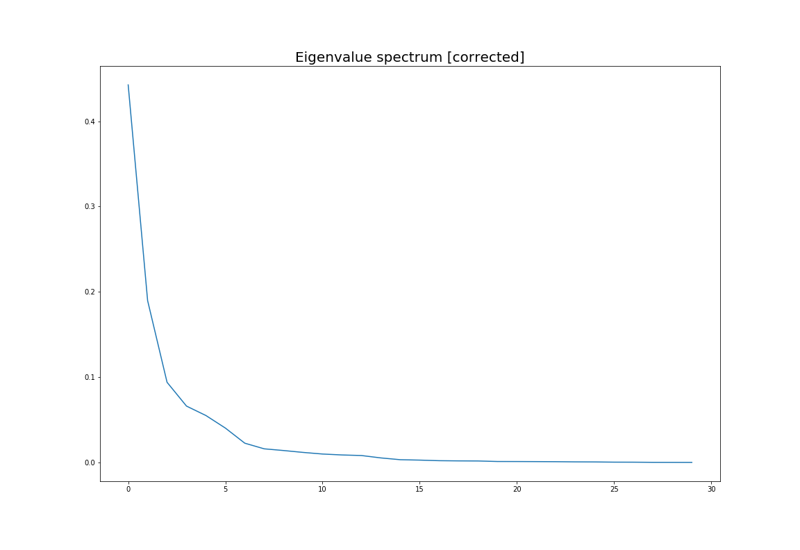
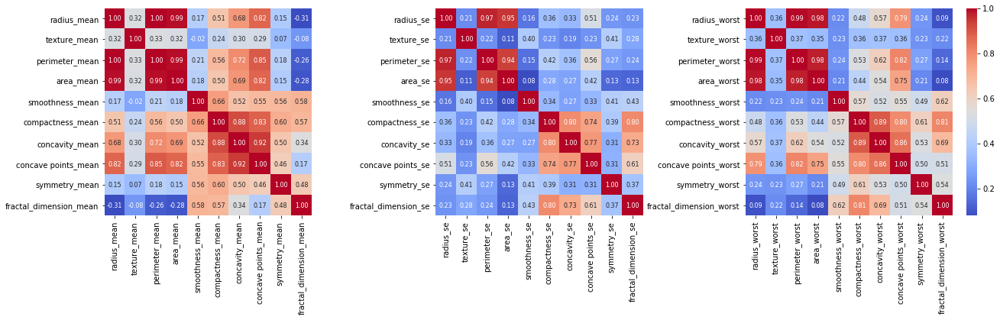

#Breast_Cancer Dataset Analysis
>*Southern University of Science and Technology, Department of Computer Science and Engineering*

>>**11510365 Xue Yiheng**

[toc]

## 1. Introduction
Features are computed from a digitized image of a fine needle aspirate(FNA) of a brase mass. They describe characteristics of the cell nuclei present in the image. In the 3-dimensional space is that described in: \[K. p. Bennett and O. L. Managasarian: "Robust Linear Programming Discrimination of Two Linearly Inseparable Sets", Optimization methods and Software 1, 1992, 23-34\].

>The Breast_Cancer dataset we used is from **UCI Machine Learning Repository**, thanks for`Dr. William H. Wolberg`, `W. Nick Street` and`Olvi L. Mangasarian` from **University of Wisconsin**[^1].

[^1]: Breast Cancer Wisconsin (Diagnostic) Data Set https://archive.ics.uci.edu/ml/datasets/Breast+Cancer+Wisconsin+%28Diagnostic%29

## 2. Data Preprocess
At first, when we get a new dataset, we need to know the size of it and try to understand each columns(although they are too difficult for us to understand). Whatever, we could analysis the types of each column, getting the useful data and drop the useless. 

Import the library we will use in this work.

```python
import numpy as np
import pandas as pd
import seaborn as sns
from matplotlib import pyplot as plt
```

Load the data as shown below. The `breat_cancer_data.csv` is saved in the folder on the desktop.

### 2.1 Import Dataset

```python
breast_cancer_data = pd.read_csv('/Users/xueyiheng/Desktop/Intelligent_Data_Analysis/dataset/breast_cancer_data.csv')
breast_cancer_data.head()
```
Show the `data.head()`, we could get the structure about this dataset, there are 33 columns which I will explain later and drop some useless columns.

***
<div>
<style scoped>
    .dataframe tbody tr th:only-of-type {
        vertical-align: middle;
    }

    .dataframe tbody tr th {
        vertical-align: top;
    }

    .dataframe thead th {
        text-align: right;
    }
</style>
<table border="1" class="dataframe">
  <thead>
    <tr width: style="text-align: right;">
      <th></th>
      <th>id</th>
      <th>diagnosis</th>
      <th>radius_mean</th>
      <th>texture_mean</th>
      <th>...</th>
      <th>concave points_worst</th>
      <th>symmetry_worst</th>
      <th>fractal_dimension_worst</th>
      <th>Unnamed: 32</th>
    </tr>
  </thead>
  <tbody>
    <tr>
      <th>0</th>
      <td>842302</td>
      <td>M</td>
      <td>17.99</td>
      <td>10.38</td>
      <td>...</td>
      <td>0.2654</td>
      <td>0.4601</td>
      <td>0.11890</td>
      <td>NaN</td>
    </tr>
    <tr>
      <th>1</th>
      <td>842517</td>
      <td>M</td>
      <td>20.57</td>
      <td>17.77</td>
      <td>...</td>
      <td>0.1860</td>
      <td>0.2750</td>
      <td>0.08902</td>
      <td>NaN</td>
    </tr>
    <tr>
      <th>2</th>
      <td>84300903</td>
      <td>M</td>
      <td>19.69</td>
      <td>21.25</td>
      <td>...</td>
      <td>0.2430</td>
      <td>0.3613</td>
      <td>0.08758</td>
      <td>NaN</td>
    </tr>
    <tr>
      <th>3</th>
      <td>84348301</td>
      <td>M</td>
      <td>11.42</td>
      <td>20.38</td>
      <td>...</td>
      <td>0.2575</td>
      <td>0.6638</td>
      <td>0.17300</td>
      <td>NaN</td>
    </tr>
    <tr>
      <th>4</th>
      <td>84358402</td>
      <td>M</td>
      <td>20.29</td>
      <td>14.34</td>
      <td>...</td>
      <td>0.1625</td>
      <td>0.2364</td>
      <td>0.07678</td>
      <td>NaN</td>
    </tr>
  </tbody>
</table>
<p>5 rows × 33 columns</p>
</div>

### 2.2 Pre-analysis

As for each row about the breast cancer patients, the diagnosis is 'M' or 'B' (which means 'malignant' or 'benign') is the most important thing. Therefore we count that how many people have malignant and benign tumors.


```python
sns.countplot(x = 'diagnosis', data = breast_cancer_data)
B, M = breast_cancer_data['diagnosis'].value_counts()

print('Number of Benign\t:\t ',B)
print('Number of Malignant\t:\t ',M)
print('Percentage Benign\t:\t % 2.2f %%' % (B/(B+M)*100))
print('Percentage Malignant\t:\t % 2.2f %%' % (M/(B+M)*100))
```

>
	Number of Benign		:	  357
	Number of Malignant		:	  212
	Percentage Benign		:	  62.74 %
	Percentage Malignant	:	  37.26 %	
	
><div align=center></div>

The whole dataset is named `breast_cancer_data`, we really need to analysis about it and drop something useless.


```python
breast_cancer_data.describe()
```

***
<div>
<style scoped>
    .dataframe tbody tr th:only-of-type {
        vertical-align: middle;
    }

    .dataframe tbody tr th {
        vertical-align: top;
    }

    .dataframe thead th {
        text-align: right;
    }
</style>
<table border="1" class="dataframe">
  <thead>
    <tr style="text-align: right;">
      <th></th>
      <th>id</th>
      <th>radius_mean</th>
      <th>texture_mean</th>
      <th>perimeter_mean</th>
      <th>...</th>
      <th>concave points_worst</th>
      <th>symmetry_worst</th>
      <th>fractal_dimension_worst</th>
      <th>Unnamed: 32</th>
    </tr>
  </thead>
  <tbody>
    <tr>
      <th>count</th>
      <td>5.690000e+02</td>
      <td>569.000000</td>
      <td>569.000000</td>
      <td>569.000000</td>
      <td>...</td>
      <td>569.000000</td>
      <td>569.000000</td>
      <td>569.000000</td>
      <td>0.0</td>
    </tr>
    <tr>
      <th>mean</th>
      <td>3.037183e+07</td>
      <td>14.127292</td>
      <td>19.289649</td>
      <td>91.969033</td>
      <td>...</td>
      <td>0.114606</td>
      <td>0.290076</td>
      <td>0.083946</td>
      <td>NaN</td>
    </tr>
    <tr>
      <th>std</th>
      <td>1.250206e+08</td>
      <td>3.524049</td>
      <td>4.301036</td>
      <td>24.298981</td>
      <td>...</td>
      <td>0.065732</td>
      <td>0.061867</td>
      <td>0.018061</td>
      <td>NaN</td>
    </tr>
    <tr>
      <th>min</th>
      <td>8.670000e+03</td>
      <td>6.981000</td>
      <td>9.710000</td>
      <td>43.790000</td>
      <td>...</td>
      <td>0.000000</td>
      <td>0.156500</td>
      <td>0.055040</td>
      <td>NaN</td>
    </tr>
    <tr>
      <th>25%</th>
      <td>8.692180e+05</td>
      <td>11.700000</td>
      <td>16.170000</td>
      <td>75.170000</td>
      <td>...</td>
      <td>0.064930</td>
      <td>0.250400</td>
      <td>0.071460</td>
      <td>NaN</td>
    </tr>
    <tr>
      <th>50%</th>
      <td>9.060240e+05</td>
      <td>13.370000</td>
      <td>18.840000</td>
      <td>86.240000</td>
      <td>...</td>
      <td>0.099930</td>
      <td>0.282200</td>
      <td>0.080040</td>
      <td>NaN</td>
    </tr>
    <tr>
      <th>75%</th>
      <td>8.813129e+06</td>
      <td>15.780000</td>
      <td>21.800000</td>
      <td>104.100000</td>
      <td>...</td>
      <td>0.161400</td>
      <td>0.317900</td>
      <td>0.092080</td>
      <td>NaN</td>
    </tr>
    <tr>
      <th>max</th>
      <td>9.113205e+08</td>
      <td>28.110000</td>
      <td>39.280000</td>
      <td>188.500000</td>
      <td>...</td>
      <td>0.291000</td>
      <td>0.663800</td>
      <td>0.207500</td>
      <td>NaN</td>
    </tr>
  </tbody>
</table>
<p>8 rows × 32 columns</p>
</div>

And the describe of each columns:
>1. **id**: ID number
2. **diagnosis**: The diagnosis of breast tissues(M = malignant, B = benign)
3. **radius_mean**: mean of distances from center to points on the perimeter
4. **texture_mean**: standard deviation of gray-scale values
5. **perimeter_mean**: mean size of the core tumor
6. **area_mean**
7. **smoothness_mean**: mean of local variation in radius lengths
8. **compactness_mean**: mean of $\frac{perimeter^2}{area}-1$
9. **concavity_mean**: mean of severity of concave portions of the contour
10. **concave points_mean**: mean for number of concave portions of the contour
11. **symmetry_mean**
12. **fractal\_dimension\_mean**: mean for $coastline\_approximation -1$
13. **radius_se**: standard error for the mean of distances from center to points on the perimeter
14. **texture_se**: standard error for standard deviation of gray-scale values
15. **perimeter_se**
16. **area_se**
17. **smoothness_se**: standard error for local variation in radius lengths
18. **compactness_se**: standard error for $\frac{perimeter^2}{area}- 1$
19. **concavity_se**: standard error for severisy of concave portions of the contour
20. **concave points_se**: standard error for number of concave portions of the contour
21. **symmetry_se**
22. **fractal\_dimension\_se**: standard error for $coastline\_approximation-1$
23. **radius_worst**: *worst* or largest mean value for mean of distances from center to points on the perimeter
24. **texture_worst**: *worst* or largest mean value for standard deviation of gray-scale values
25. **perimeter_worst**
26. **area_worst**
27. **smoothness_worst**: *worst* or largest mean value for local variation in radius lengths
28. **compactness_worst**: *worst* or largest mean value for $\frac{perimeter^2}{area}-1$
29. **concavity_worst**: *worst* or largest mean value for severity of concave portions of the contour
30. **concave points_worst**: *worst* of largest mean value for number of concave portions of the contour
31. **symmetry_worst**
32. **fractal\_dimension\_worst**: *worst* or largest mean value for $coastline\_approximation-1$
            
We do the pre-analysis of the dataset, we can easily get the points that 'diagnosis' is only one column that is not numeric format, and 'M' means malignant, 'B' means benign. Besides this point, 'id' is needless in my work. Therefore, I need to drop it.

### 2.3 Drop the Useless Data
Drop function is used to delete the row or the line, we need to add`axis = 1` when we want to delete the column, and I will drop the 3 columns and transform the dataframe to the float type.

```python
data = breast_cancer_data.drop(['id', 'diagnosis', 'Unnamed: 32'], axis = 1).astype(np.float)
target = breast_cancer_data['diagnosis']
data.head()
```

***
<div>
<style scoped>
    .dataframe tbody tr th:only-of-type {
        vertical-align: middle;
    }

    .dataframe tbody tr th {
        vertical-align: top;
    }

    .dataframe thead th {
        text-align: right;
    }
</style>
<table border="1" class="dataframe">
  <thead>
    <tr style="text-align: right;">
      <th></th>
      <th>radius_mean</th>
      <th>texture_mean</th>
      <th>perimeter_mean</th>
      <th>area_mean</th>
      <th>...</th>
      <th>concavity_worst</th>
      <th>concave points_worst</th>
      <th>symmetry_worst</th>
      <th>fractal_dimension_worst</th>
    </tr>
  </thead>
  <tbody>
    <tr>
      <th>0</th>
      <td>17.99</td>
      <td>10.38</td>
      <td>122.80</td>
      <td>1001.0</td>
      <td>...</td>
      <td>0.7119</td>
      <td>0.2654</td>
      <td>0.4601</td>
      <td>0.11890</td>
    </tr>
    <tr>
      <th>1</th>
      <td>20.57</td>
      <td>17.77</td>
      <td>132.90</td>
      <td>1326.0</td>
      <td>...</td>
      <td>0.2416</td>
      <td>0.1860</td>
      <td>0.2750</td>
      <td>0.08902</td>
    </tr>
    <tr>
      <th>2</th>
      <td>19.69</td>
      <td>21.25</td>
      <td>130.00</td>
      <td>1203.0</td>
      <td>...</td>
      <td>0.4504</td>
      <td>0.2430</td>
      <td>0.3613</td>
      <td>0.08758</td>
    </tr>
    <tr>
      <th>3</th>
      <td>11.42</td>
      <td>20.38</td>
      <td>77.58</td>
      <td>386.1</td>
      <td>...</td>
      <td>0.6869</td>
      <td>0.2575</td>
      <td>0.6638</td>
      <td>0.17300</td>
    </tr>
    <tr>
      <th>4</th>
      <td>20.29</td>
      <td>14.34</td>
      <td>135.10</td>
      <td>1297.0</td>
      <td>...</td>
      <td>0.4000</td>
      <td>0.1625</td>
      <td>0.2364</td>
      <td>0.07678</td>
    </tr>
  </tbody>
</table>
<p>5 rows × 30 columns</p>
</div>


```python
data.describe()
```

<div>
<style scoped>
    .dataframe tbody tr th:only-of-type {
        vertical-align: middle;
    }

    .dataframe tbody tr th {
        vertical-align: top;
    }

    .dataframe thead th {
        text-align: right;
    }
</style>
<table border="1" class="dataframe">
  <thead>
    <tr style="text-align: right;">
      <th></th>
      <th>radius_mean</th>
      <th>texture_mean</th>
      <th>perimeter_mean</th>
      <th>area_mean</th>
      <th>...</th>
      <th>concavity_worst</th>
      <th>concave points_worst</th>
      <th>symmetry_worst</th>
      <th>fractal_dimension_worst</th>
    </tr>
  </thead>
  <tbody>
    <tr>
      <th>count</th>
      <td>569.000000</td>
      <td>569.000000</td>
      <td>569.000000</td>
      <td>569.000000</td>
      <td>...</td>
      <td>569.000000</td>
      <td>569.000000</td>
      <td>569.000000</td>
      <td>569.000000</td>
    </tr>
    <tr>
      <th>mean</th>
      <td>14.127292</td>
      <td>19.289649</td>
      <td>91.969033</td>
      <td>654.889104</td>
      <td>...</td>
      <td>0.272188</td>
      <td>0.114606</td>
      <td>0.290076</td>
      <td>0.083946</td>
    </tr>
    <tr>
      <th>std</th>
      <td>3.524049</td>
      <td>4.301036</td>
      <td>24.298981</td>
      <td>351.914129</td>
      <td>...</td>
      <td>0.208624</td>
      <td>0.065732</td>
      <td>0.061867</td>
      <td>0.018061</td>
    </tr>
    <tr>
      <th>min</th>
      <td>6.981000</td>
      <td>9.710000</td>
      <td>43.790000</td>
      <td>143.500000</td>
      <td>...</td>
      <td>0.000000</td>
      <td>0.000000</td>
      <td>0.156500</td>
      <td>0.055040</td>
    </tr>
    <tr>
      <th>25%</th>
      <td>11.700000</td>
      <td>16.170000</td>
      <td>75.170000</td>
      <td>420.300000</td>
      <td>...</td>
      <td>0.114500</td>
      <td>0.064930</td>
      <td>0.250400</td>
      <td>0.071460</td>
    </tr>
    <tr>
      <th>50%</th>
      <td>13.370000</td>
      <td>18.840000</td>
      <td>86.240000</td>
      <td>551.100000</td>
      <td>...</td>
      <td>0.226700</td>
      <td>0.099930</td>
      <td>0.282200</td>
      <td>0.080040</td>
    </tr>
    <tr>
      <th>75%</th>
      <td>15.780000</td>
      <td>21.800000</td>
      <td>104.100000</td>
      <td>782.700000</td>
      <td>...</td>
      <td>0.382900</td>
      <td>0.161400</td>
      <td>0.317900</td>
      <td>0.092080</td>
    </tr>
    <tr>
      <th>max</th>
      <td>28.110000</td>
      <td>39.280000</td>
      <td>188.500000</td>
      <td>2501.000000</td>
      <td>...</td>
      <td>1.252000</td>
      <td>0.291000</td>
      <td>0.663800</td>
      <td>0.207500</td>
    </tr>
  </tbody>
</table>
<p>8 rows × 30 columns</p>
</div>


We can easily know that there are 30 columns we will use in the next steps.


```python
list(data.columns)
```
>
    ['radius_mean',
     'texture_mean',
     'perimeter_mean',
     'area_mean',
     'smoothness_mean',
     'compactness_mean',
     'concavity_mean',
     'concave points_mean',
     'symmetry_mean',
     'fractal_dimension_mean',
     'radius_se',
     'texture_se',
     'perimeter_se',
     'area_se',
     'smoothness_se',
     'compactness_se',
     'concavity_se',
     'concave points_se',
     'symmetry_se',
     'fractal_dimension_se',
     'radius_worst',
     'texture_worst',
     'perimeter_worst',
     'area_worst',
     'smoothness_worst',
     'compactness_worst',
     'concavity_worst',
     'concave points_worst',
     'symmetry_worst',
     'fractal_dimension_worst']


And we get a matrix type of data named 'data_test', maybe we will use later.

```python
data_test = np.mat(data)
data_test
```
>
    matrix([[1.799e+01, 1.038e+01, 1.228e+02, ..., 2.654e-01, 4.601e-01,
             1.189e-01],
            [2.057e+01, 1.777e+01, 1.329e+02, ..., 1.860e-01, 2.750e-01,
             8.902e-02],
            [1.969e+01, 2.125e+01, 1.300e+02, ..., 2.430e-01, 3.613e-01,
             8.758e-02],
            ...,
            [1.660e+01, 2.808e+01, 1.083e+02, ..., 1.418e-01, 2.218e-01,
             7.820e-02],
            [2.060e+01, 2.933e+01, 1.401e+02, ..., 2.650e-01, 4.087e-01,
             1.240e-01],
            [7.760e+00, 2.454e+01, 4.792e+01, ..., 0.000e+00, 2.871e-01,
             7.039e-02]])


### 2.4 Data Standardisation


```python
data_2 = data.values
target_2 = target.apply(lambda x: 0 if x=='B' else 1).values
print(data_2)
print(data_2.shape)
print("The shape of 'data_2' is ", data_2.shape)
print("The type of 'data_2' is ", data_2.dtype)
```
The `data_2` is my own way to get the array type of data which I will use in the next work.

>
    [[1.799e+01 1.038e+01 1.228e+02 ... 2.654e-01 4.601e-01 1.189e-01]
     [2.057e+01 1.777e+01 1.329e+02 ... 1.860e-01 2.750e-01 8.902e-02]
     [1.969e+01 2.125e+01 1.300e+02 ... 2.430e-01 3.613e-01 8.758e-02]
     ...
     [1.660e+01 2.808e+01 1.083e+02 ... 1.418e-01 2.218e-01 7.820e-02]
     [2.060e+01 2.933e+01 1.401e+02 ... 2.650e-01 4.087e-01 1.240e-01]
     [7.760e+00 2.454e+01 4.792e+01 ... 0.000e+00 2.871e-01 7.039e-02]]
    (569, 30)
    The shape of 'data_2' is  (569, 30)
    The type of 'data_2' is  float64


```python
from sklearn.preprocessing import StandardScaler
data_std = StandardScaler().fit_transform(data_2)
print("The shape of 'data_std' is ", data_std.shape)
print("The type of 'data_std' is ", data_std.dtype)
```
The `data_std` have used the `sklearn.preprocessing-StandardScaler` package and get the same results with the `data_2`.

>
    The shape of 'data_std' is  (569, 30)
    The type of 'data_std' is  float64

```python
data
```
>*This step we will get the 'data' output, it is a huge document and I have canceled it in my report, it just used to help me to verify the structure of the data when I get it first.*


## 3. Principal Component Analysis

Principal Component Analysis(PCA) is a dimension-reduction tool that can be used to reduce a large set of variables to a small set that still contains most of the information in the large set. The `Breast_Cancer` dataset is more than 30 columns and near 600 rows, it is very suitable to use the PCA function to deal with it. Principal component analysis is a mathematical procedure that transforms a number of correlated variabled into a smaller number of uncorrelated variabled called principal components.

PCA seeks a linear combination of variables such that the maximum variance is extracted from the variables and then removes this variance and seeks a second linear combination which explains the maximum proportion of the remaining variance, and so on. This is called the principal axis method and results in orthogonal factors.

It works as the steps below.

>1. Take teh whole dataset consiting of d-dimensional samples and ignoring the class labels.
2. Computer the d-dimensional mena vector.
3. Computer the scatter matrix of the whole data set.
4. Computer eigenvectors and corresponding eigenvalues.
5. Sort the eigenvectors by decreasing eigenvalues and choose $k$ eigenvectors with the largest eigenvalues to form a $d\times k$ dimensional matrix $W$
6. Use this eigenvector matrix to transform the samples onto the new subspace, this can be summarized by the mathematical equation: $y=W^T\times x$.	[^2]

[^2]: PCA tutorial, http://sebastianraschka.com


**In a word, principal component analysis is mainly used to reduce the dimension of the data set, and then pick out the main characteristics.** As for a low-dimension of the data set, we can calculate and analysis easily and directly, it is necessary to do pca for a high-dimension data set before analysing.
### 3.1 PCA Plot

1. Taking the whole dataset ignoring the class labels, I have finished it before.
2. Computing the d-dimensional mean vector `average = meanX(XMat)`
3. Computing the scatter matrix, The scatter matrix is computed by $S=\sum_{k=1}^{n}(x_k-m)(x_k-m)^T$,and the mean vector $m=\frac{1}{n}\sum_{k=1}^{n}x_k$, it can work with the code `return np.mean(dataX, axis = 0)`, where average is the mean values.
4. Computing the covariance matrix `covX = np.cov(data_adjust.T)`
5. Computing eigenvectors and corresponding eigenvalues ` featValue, featVec = np.linalg.eig(covX)` $Covariance \_matrix \times Eigenvector=Eigenvalue \times Eigenvector$
6. Sorting the eigenvectors by decreasing eigenvalues `index = np.argsort(-featValue)`
7. Choosing k eigenvectors with the largest eigenvalues
8. Transforming the samples onto the new subspace

```python
def meanX(dataX):
    return np.mean(dataX, axis = 0) # 'axis = 0' means get the data from the row, and then 'axis = 1' means from the column

def pca(XMat, k):
    average = meanX(XMat)
    m, n = np.shape(XMat)
    data_adjust = []
    avgs = np.tile(average, (m, 1))
    data_adjust = XMat - avgs
    covX = np.cov(data_adjust.T) # Calculate the convariance matrix
    featValue, featVec = np.linalg.eig(covX) # Calculate the eigenvector and eigenvalue of the convariance matrix
    index = np.argsort(-featValue) # Sort from big to small
    finalData = []
    selectVec = np.matrix(featVec.T[index[:k]])
    finalData = data_adjust * selectVec.T
    reconData = (finalData * selectVec) + average
    
    plt.figure(figsize = (16, 11))
    plt.plot(featValue/1000000, 'k', linewidth=2)
    plt.xlabel('n_components')
    plt.ylabel('explained_variance')
    plt.title('Eigenvalue spectrum', size=20)
    plt.show()
    
    return finalData, reconData, index

def plotBestFit(data1, data2):    
    dataArr1 = np.array(data1)
    dataArr2 = np.array(data2)
 
    m = np.shape(dataArr1)[0]
    axis_x1 = []
    axis_y1 = []
    axis_x2 = []
    axis_y2 = []
    for i in range(m):
        axis_x1.append(dataArr1[i,0])
        axis_y1.append(dataArr1[i,1])
        axis_x2.append(dataArr2[i,0]) 
        axis_y2.append(dataArr2[i,1])                 
    fig = plt.figure(figsize=(16, 11))
    ax = fig.add_subplot(111)
    ax.scatter(axis_x1, axis_y1, s=20, c='red', marker='.')
    ax.scatter(axis_x2, axis_y2, s=5, c='blue', marker='.')
    plt.xlabel('x1')
    plt.ylabel('x2')
    plt.title('2-D PCA projections', size=20)
    #plt.savefig("outfile.png")
    plt.show() 
    #XMat = np.array(data)
    #XMat = np.loadtxt(open("/Users/xueyiheng/Desktop/Intelligent_Data_Analysis/dataset/breast_cancer_data.csv","rb"),delimiter=",",skiprows=0) 

def main():
    #datafile = "/Users/xueyiheng/Desktop/Intelligent_Data_Analysis/dataset/breast_cancer_data.txt"
    #XMat = loaddat(datafile)
    XMat = np.array(data)
    k = 2
    return pca(XMat, k)
if __name__=="__main__":
    finalData, reconMat, index = main()
    plotBestFit(finalData, reconMat)
    #print (index)
```
***

***

Congratulations! I get the results, there are 2 kinds of points, the red one and the blue one.

### 3.2 Compare the Results with the PCA Package

And we compare our results with the sklearn-decomposition PCA package. Some details are different between them, but the whole diagram is in the same trends.

```python
from sklearn.decomposition import PCA
pca = PCA()
pca.fit(data_std)
plt.figure(figsize = (16, 11))
plt.title('Eigenvalue spectrum [sklearn-PCA]', size=20)
plt.plot(pca.explained_variance_ratio_)

x = data.values
pca = PCA(n_components = 2)
pca_2d = pca.fit_transform(x)

#Plot the PCA figure
plt.figure(figsize = (16, 11))
plt.scatter(pca_2d[:,0], pca_2d[:,1], c = target, s=20, cmap = 'coolwarm', edgecolor = 'None', alpha = 0.35)
#plt.colorbar()
plt.title('PCA Scatter Plot [sklearn-PCA]', size=20)
plt.show()
```
***

***

### 3.3 Analysis

Sadly, I found some different between the two results, I regard the `sklearn-PCA` is the right answer without mistake. My figure in **3.1-figure2**, the blue points is getting together, almost become one point. When I finished my codes, I found that in the defination `main`
```python
XMat = np.array(data)
```
I use the `data` which is not a standardisation one, this is my mistake. And I have finished this step in **2.4**, my standardisation data named `data_2`, and the standardisation data used `sklearn-StandardScaler` named `data_std`, and I use both of them get the results as below.

>

Unfortunately, my standardisation data is not well, and I change the data, use the `data_std` from `sklearn-StandardScaler` package. After few seconds, I get the results as below.
>

I realized that there are some mistakes in my data, the `Eigenvalue spectrum` figure is right if I finished the data standard right. Actually, I found that in my step **2.4** which I called it `Data StandardScaler`, I did not finish the whole standard work, I just get the values from `data` to `data_2`, and try to standard it in the `def pca` in the PCA part. Therefore the red points used my`data_2` is almost right, because I finish all of the data work in 3 parts. And when I use`data_std`, the red points is deformity, because the `sklearn-StandardScaler` helped me finished the standard work, and I do it again in my pca definition, I do not need to do it again.

I correct my mistake, get the results as below.



##4. Self-orgnizing Map
###4.1 Introduction
SOM is non-linear algorithm like PCA. SOM is seen as a constraint version of k - means that different from k - means all feature points between unrelated, SOM of the feature points in an imaginary box above, the distance between each feature points based on grid are different degree of correlation. It works as below.

>1. Randomly position the grid’s neurons in the data space.
2. Select one data point, either randomly or systematically cycling through the dataset in order
3. Find the neuron that is closest to the chosen data point. This neuron is called the Best Matching Unit (BMU).
4. Move the BMU closer to that data point. The distance moved by the BMU is determined by a learning rate, which decreases after each iteration.
5. Move the BMU’s neighbors closer to that data point as well, with farther away neighbors moving less. Neighbors are identified using a radius around the BMU, and the value for this radius decreases after each iteration.
6. Update the learning rate and BMU radius, before repeating Steps 1 to 4. Iterate these steps until positions of neurons have been stabilized[^3].

[^3]: This is a tutorial from a web site https://algobeans.com

```python
import numpy as np
import pylab as pl

class SOM(object):
    def __init__(self, X, output, iteration, batch_size):
        self.X = X
        self.output = output
        self.iteration = iteration
        self.batch_size = batch_size
        self.W = np.random.rand(X.shape[1], output[0] * output[1])
        print (self.W.shape)

    def GetN(self, t):
        a = min(self.output)
        return int(a-float(a)*t/self.iteration)

    def Geteta(self, t, n):
        return np.power(np.e, -n)/(t+2)

    def updata_W(self, X, t, winner):
        N = self.GetN(t)
        for x, i in enumerate(winner):
            to_update = self.getneighbor(i[0], N)
            for j in range(N+1):
                e = self.Geteta(t, j)
                for w in to_update[j]:
                    self.W[:, w] = np.add(self.W[:,w], e*(X[x,:] - self.W[:,w]))

    def getneighbor(self, index, N):
        a, b = self.output
        length = a*b
        def distence(index1, index2):
            i1_a, i1_b = index1 // a, index1 % b
            i2_a, i2_b = index2 // a, index2 % b
            return np.abs(i1_a - i2_a), np.abs(i1_b - i2_b)

        ans = [set() for i in range(N+1)]
        for i in range(length):
            dist_a, dist_b = distence(i, index)
            if dist_a <= N and dist_b <= N: ans[max(dist_a, dist_b)].add(i)
        return ans

    def train(self):
        count = 0
        while self.iteration > count:
            train_X = self.X[np.random.choice(self.X.shape[0], self.batch_size)]
            normal_W(self.W)
            normal_X(train_X)
            train_Y = train_X.dot(self.W)
            winner = np.argmax(train_Y, axis=1).tolist()
            self.updata_W(train_X, count, winner)
            count += 1
        return self.W

    def train_result(self):
        normal_X(self.X)
        train_Y = self.X.dot(self.W)
        winner = np.argmax(train_Y, axis=1).tolist()
        #print (winner)
        return winner

def normal_X(X):
    N, D = X.shape
    for i in range(N):
        temp = np.sum(np.multiply(X[i], X[i]))
        X[i] /= np.sqrt(temp)
    return X
def normal_W(W):
    for i in range(W.shape[1]):
        temp = np.sum(np.multiply(W[:,i], W[:,i]))
        W[:, i] /= np.sqrt(temp)
    return W

def draw(C):
    for i in range(len(C)):
        coo_X = []    #x_list
        coo_Y = []    #y_list
        for j in range(len(C[i])):
            coo_X.append(C[i][j][0])
            coo_Y.append(C[i][j][1])
        pl.scatter(coo_X, coo_Y, marker='x', color=colValue[i%len(colValue)], label=i)

    pl.legend(loc='upper right')
    pl.show()

dataset = np.mat(data)
dataset_old = dataset.copy()

som = SOM(dataset, (5, 5), 1, 30)
som.train()
res = som.train_result()
classify = {}
for i, win in enumerate(res):
    if not classify.get(win[0]):
        classify.setdefault(win[0], [i])
    else:
        classify[win[0]].append(i)
C = []
D = []
for i in classify.values():
    C.append(dataset_old[i].tolist())
    D.append(dataset[i].tolist())
draw(C)
draw(D)

```


## 5. Clustering

```python
#coding=utf-8
from numpy import *
    
def distEclud(vecA, vecB):
    return sqrt(sum(power(vecA - vecB, 2)))
   
def randCent(dataSet, k):
    n = shape(dataSet)[1]
    centroids = mat(zeros((k,n)))
    for j in range(n):
        minJ = min(dataSet[:,j])
        rangeJ = float(max(array(dataSet)[:,j]) - minJ)
        centroids[:,j] = minJ + rangeJ * random.rand(k,1)
    return centroids
    
def kMeans(dataSet, k, distMeas=distEclud, createCent=randCent):
    m = shape(dataSet)[0]
    clusterAssment = mat(zeros((m,2)))
    centroids = createCent(dataSet, k)
    clusterChanged = True
    while clusterChanged:
        clusterChanged = False
        for i in range(m):#for each data point assign it to the closest centroid
            minDist = inf
            minIndex = -1
            for j in range(k):
                distJI = distMeas(centroids[j,:],dataSet[i,:])
                if distJI < minDist:
                    minDist = distJI; minIndex = j
            if clusterAssment[i,0] != minIndex: 
                clusterChanged = True
            clusterAssment[i,:] = minIndex,minDist**2
        for cent in range(k):#recalculate centroids
            ptsInClust = dataSet[nonzero(clusterAssment[:,0].A==cent)[0]]#get all the point in this cluster
            centroids[cent,:] = mean(ptsInClust, axis=0) 
    return centroids, clusterAssment
    
def show(dataSet, k, centroids, clusterAssment):
    from matplotlib import pyplot as plt  
    plt.figure(figsize = (16, 11))
    numSamples, dim = dataSet.shape  
    for i in range(numSamples):  
        markIndex = int(clusterAssment[i, 0])  
        plt.plot(dataSet[i, 0], dataSet[i, 1], mark[markIndex])   
    for i in range(k):  
        plt.plot(centroids[i, 0], centroids[i, 1], mark[i], markersize = 15)
    plt.title('Clustering', size=20)
    plt.show()
      
def main():
    dataMat = finalData
    myCentroids, clustAssing= kMeans(dataMat,3)
    print (myCentroids)
    show(dataMat, 3, myCentroids, clustAssing)  
    
    
if __name__ == '__main__':
    main()
```
>
    The centers are:
    [[ 2.17729736e+03 -5.93809671e+01]
     [-3.19153554e+02 -1.25394223e+00]
     [ 7.89654752e+02  1.37700793e+01]]

These are the 3 center points, and these will shown in the next figure. I use the circle to mark them.

<div align=center></div>

##6. What is the relationship between each columns?
It is really a interesting dataset, there are more than 30 columns which is independent on the breast cancer. I want to know the relationship between each one, in other words, which column is link to another? Therefore I use the `heatmap` and show them as below.

```python
f,ax=plt.subplots(figsize = (18,18))
sns.heatmap(data.corr(),annot= True,linewidths=0.5,fmt = ".2f",ax=ax,cmap= 'coolwarm')
plt.xticks(rotation=90)
plt.yticks(rotation=0)
plt.title('Correlation Map', size=20)
plt.show()
```


And there is another figure I have got.

<div align=center></div>

With the help of this heat map we can know that:

* `compactness_mean`, `concavity_mean`and`concavepoint_mean`are highly correlated.
* `radius`, `area`and`parimeter`are highly correlated.
* `compactness_mean`, `concavity_mean`and`concave points_mean`are correlated with each other.


We want to know the relationship between each two columns, therefore we get this 'heatmap'. The range of the number in the matrix is between \[-1, 1\]. The lightest '1.0' means that two variable are positively correlated with each other, and '-1.0' means negatively correalted with each other. And we find that there are 3 different types, `\_mean`, `\_se`, `\_worst`, and we need to analysis them in 3 diagrams. [^4]

[^4]: https://blog.csdn.net/qq_37904945/article/details/79785913

```python
plt.figure(figsize=(22,5))
plt.subplot(1, 3, 1)
sns.heatmap(data[data.columns[0:10]].corr(), cbar = False,  square = True, annot=True, fmt= '.2f',annot_kws={'size': 8},cmap= 'coolwarm')
plt.subplot(1, 3, 2)
sns.heatmap(data[data.columns[10:20]].corr(), cbar = False,  square = True, annot=True, fmt= '.2f',annot_kws={'size': 8},cmap= 'coolwarm')
plt.subplot(1, 3, 3)
sns.heatmap(data[data.columns[20:30]].corr(), cbar = True,  square = True, annot=True, fmt= '.2f',annot_kws={'size': 8},cmap= 'coolwarm')
```




##7. Future Data Preprocessing
I have used pca to transform a high-dimensional dataset to a 2-D dataset which I could easily plot. But with this step, it must lost some informations, if I could plot a 3-D or 4-D figure, it will be more real. 4-D figure is based on 3-D and paint different points with different colors.

##8. Lessons Learnt
During this lecture, I have learnt PCA, SOM, clustering and the most important skills to deal with a huge dataset. When I face to a high-dimensional dataset, I could use some skills to pick up the useful points and get the most importang columns to do the next analysis, which could help me to decrease the calculating time and CPU time, and make the data be easy visualization. Mining informations from datasets is really useful in the real world.

##9. Future Investigation
I am interesting about the data mining, and interested in the financial sector, I would like to use both of the data mining skills and some financial fundamentals to do the interesting things. In Delivering Deal Value part, I want to do some analysis research about many companies and try to validate their business decisions. For example, if I could log in the database of the company like ***TaoBao*** or ***eBuy***, I need to get the Transaction Details Bills which include the information about the customers and products, therefore I could know which one or which kinds of products is more popular and as for each customer, I can know which kinds of products he likes, and I can offer him a special advertising.


>==The code named `Breast_Cancer.py` is in the folder==
